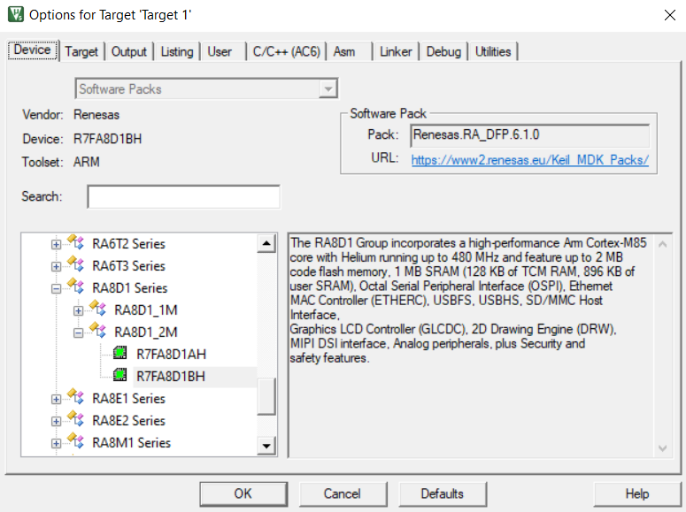
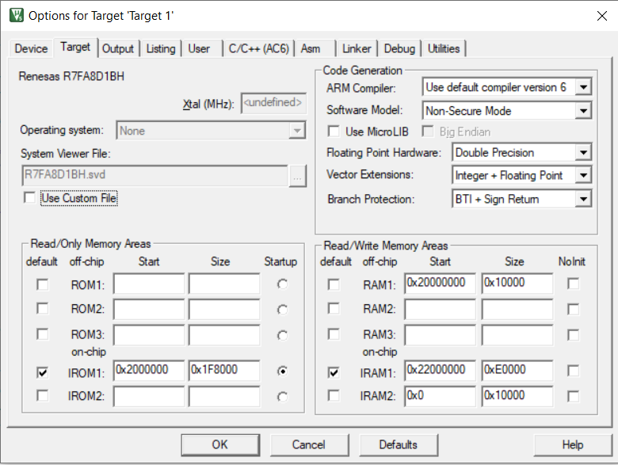
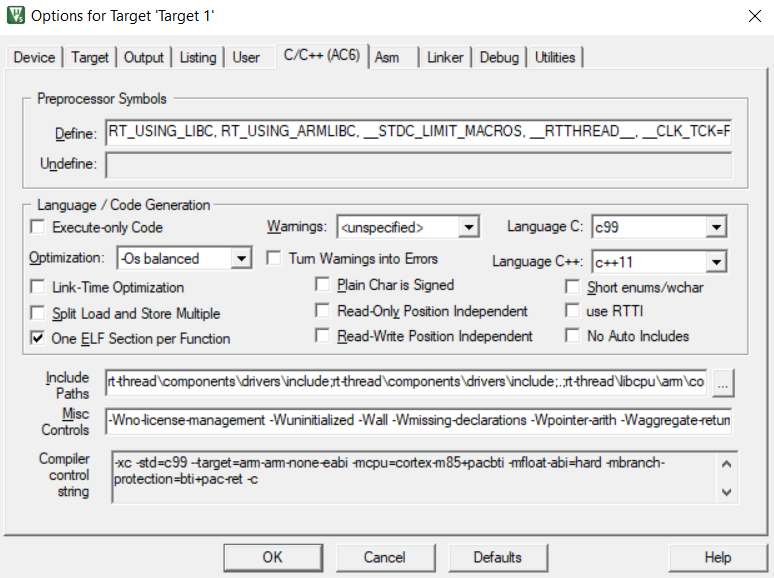
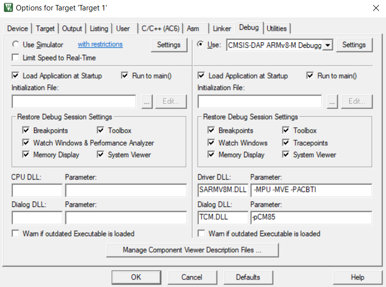
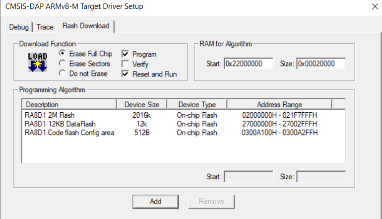

# Installations

## Software Pack

# Quick Start

## Create Libraries Links

Run `mklink.bat` at the root path of each project, to create links for `libraries` and `rt-thread`

## Options for Building Target

### With PAC-BTI

Misc Controls: `-Wno-license-management -Wuninitialized -Wall -Wmissing-declarations -Wpointer-arith -Waggregate-return -Wfloat-equal -mbranch-protection=bti+pac-ret+leaf`

### Without PAC-BTI

