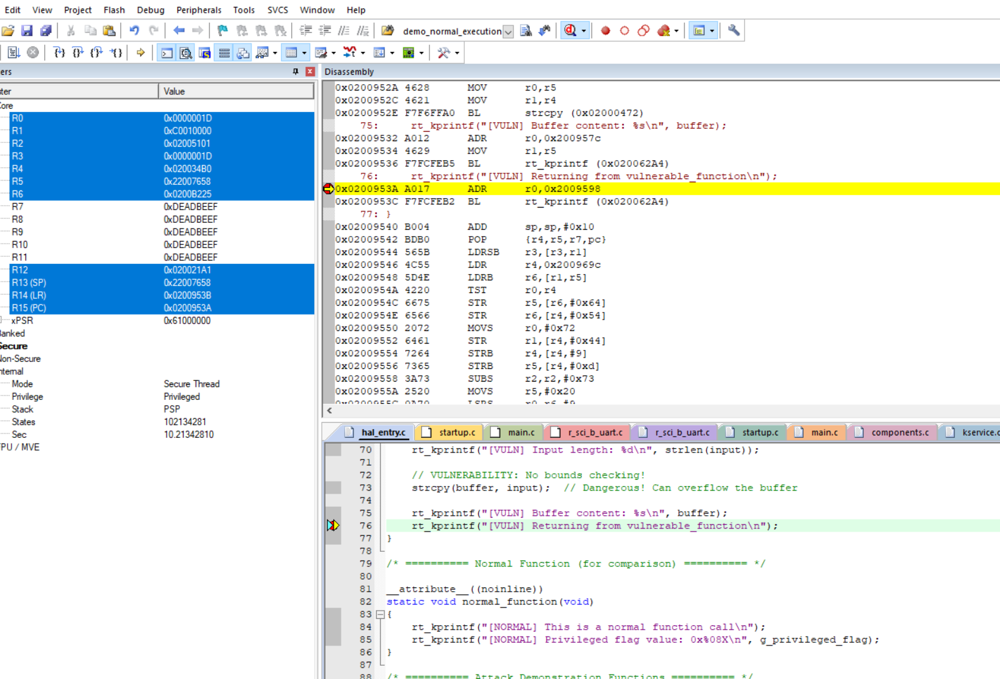
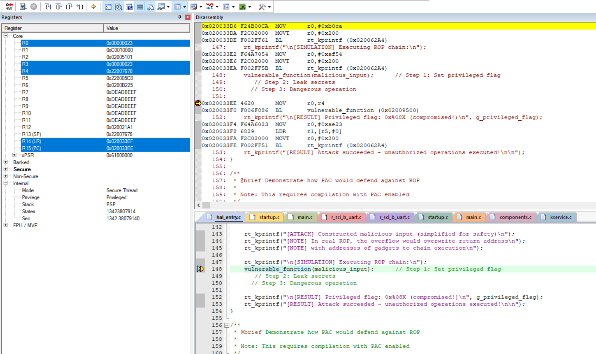
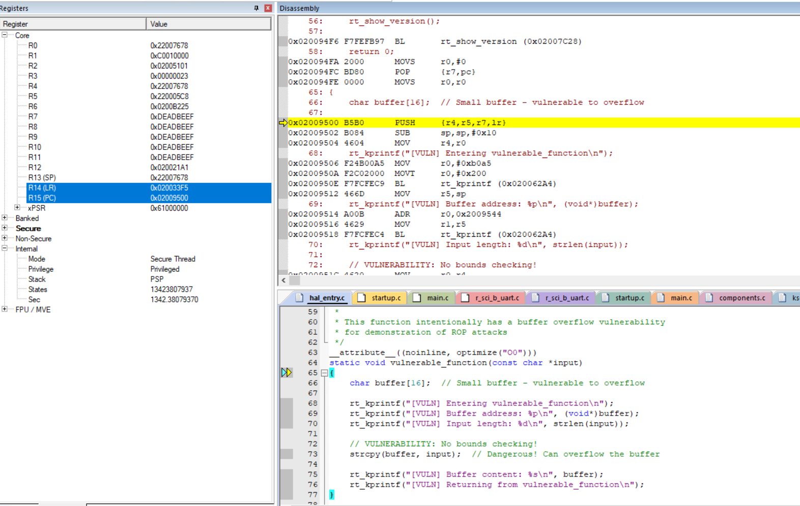
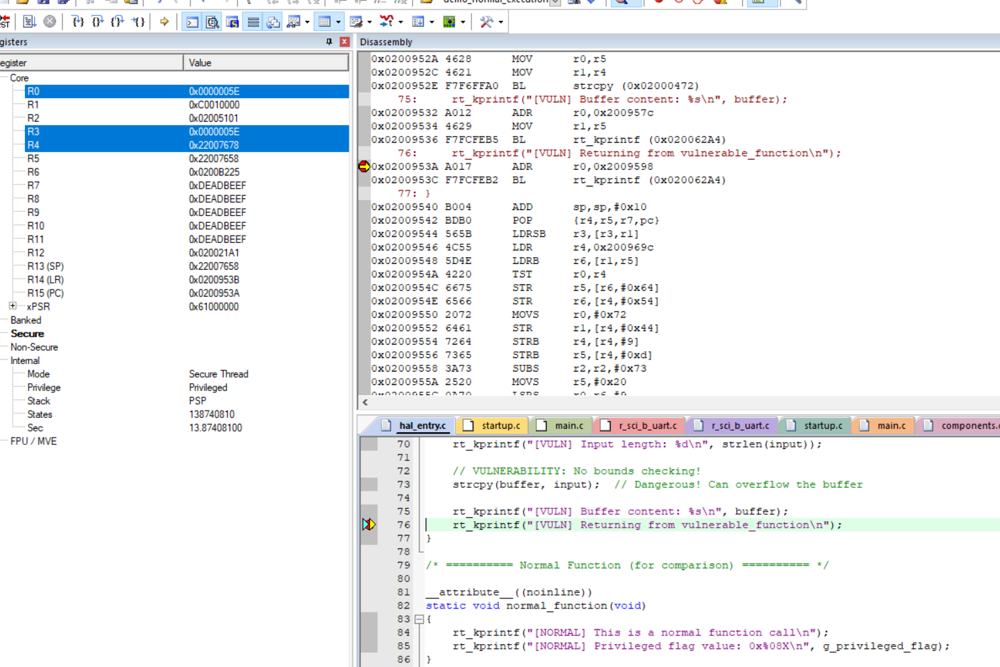
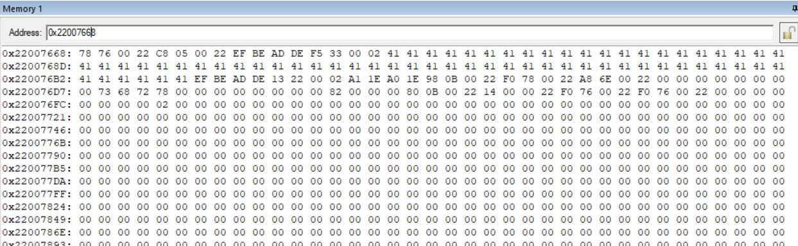
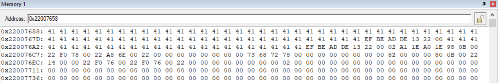

## Normal

## ROP

0x020033EF - > LR
Memory:
0x22007678： AAAAAAA...

Entre func:
LR: 0x020033F5
R4: 0x22007678
R5: 0x220005c8
R7: Deadbeef
SP: 0x22007678

PUSH 后：
SP: 0x22007668

copy 后：

Attack：

[WARNING] Launching ROP attack...

[SIMULATION] Executing ROP chain:
[VULN] Entering vulnerable_function
[VULN] Buffer address: 0x22007658
[VULN] Input length: 30
[VULN] Buffer content: AAAAAAAAAAAAAAAAAAAAAAAAAAAA¡1
[VULN] Returning from vulnerable_function
[GADGET] Setting privileged flag!
[GADGET] Setting privileged flag!
[GADGET] Executing dangerous operation!
psr: 0x60100000
r00: 0x220005c8
r01: 0xdeadbeef
r02: 0x020051b1
r03: 0x00000028
r04: 0x41414141
r05: 0x41414141
r06: 0x0200317d
r07: 0x02004afd
r08: 0x0200ba50
r09: 0x22007678
r10: 0x00000000
r11: 0x220005c8
r12: 0x020021a1
 lr: 0x020031b5
 pc: 0x0200ba00
hard fault on thread: main

rt_thread_ thread       pri  status      sp     stack size max used left tick  error
---------- ------------ ---  ------- ---------- ----------  ------  ---------- ---
0x22007908 tshell        20  ready   0x00000044 0x00001000    01%   0x0000000a OK
0x22000798 tidle0        31  ready   0x00000044 0x00000100    26%   0x00000020 OK
0x22000264 timer          4  suspend 0x00000044 0x00000200    13%   0x00000009 OK
0x22006e10 main          10  running 0x00000044 0x00000800    13%   0x00000007 OK
FPU active!
usage fault:
SCB_CFSR_UFSR:0x02 INVSTATE

