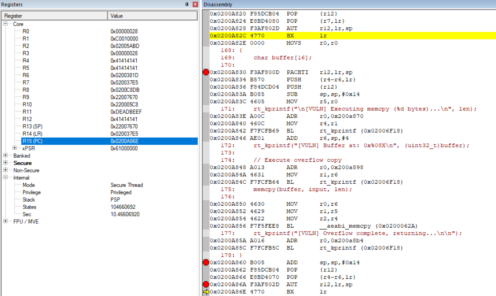

# ROP Attack Demo on ARM Cortex-M85 

## Without enabling PACBTI

- Arm Compiler - version 6
- Branch Protection - Not used

### Implementation Summary
- Vulnerable Function:
A function with a fixed-size buffer and an unsafe memcpy, allowing overflow of the return address and registers on the stack.

> Note that, I didn't use `strcpy` but `memcpy` because the addresses of functions contain `\0` which will stop the copying.

- ROP Gadgets:
Four naked functions implemented in assembly, each ending with POP {pc} to continue the ROP chain:
    - gadget_set_flag – Sets a privileged flag (g_privileged_flag = 0xDEADBEEF)
    - gadget_leak_secret – Simulates prints a secret value
    - gadget_dangerous_op – Simulates a dangerous operation
    - gadget_exit – Prints changed flag and enters a fast LED blinking loop

- ROP Chain Construction:
The attack payload is constructed to overflow the buffer and overwrite the saved PC with the address of the first gadget. Each gadget pops the next address from the stack, chaining execution.

> Note that, for this simplified ROP chain, I used naked asm code to help controlling the LR/PC, and jumpping among functions, each of them is trying to simulate some behaviors that could be dangerous.

### ROP Chain Structure

```
+--------------------------+
| gadget_set_flag          |   -- Sets privileged flag
|      ↓  POP {pc}         |
+--------------------------+
| gadget_leak_secret       |   -- Leaks secret info
|      ↓  POP {pc}         |
+--------------------------+
| gadget_dangerous_op      |   -- Performs dangerous operation
|      ↓  POP {pc}         |
+--------------------------+
| gadget_exit              |   -- Prints changed flag and enters a fast LED blinking loop
|      ↓  B loop           |
+--------------------------+
        Safe End ✓
```

## OUTPUT Example

```shell
================================================================
      ARM Cortex-M85 ROP Attack Demonstration
          PAC/BTI Security Features
================================================================

================================================================
         ROP Attack & PAC Defense - Demo Summary
================================================================
 ROP (Return-Oriented Programming):
  - Exploits buffer overflow to overwrite return addresses
  - Chains together existing code snippets (gadgets)
  - Bypasses DEP/NX by reusing existing executable code

 PAC (Pointer Authentication Codes):
  - Signs return addresses with cryptographic signature
  - Verifies signature before using the return address
  - Tampered addresses cause authentication fault
  - Effectively defeats ROP attacks

 Cortex-M85 Implementation:
  - PACIASP: Sign LR on function entry
  - AUTIASP: Authenticate LR on function return
  - Enabled with: -mbranch-protection=pac-ret+bti
================================================================


=== DEMO 1: Normal Execution ===

[VULN] Executing memcpy (6 bytes)...
[VULN] Buffer at: 0x22007658
[VULN] Overflow complete, returning...

[NORMAL] This is a normal function call
[NORMAL] Privileged flag value: 0x00000000
[RESULT] Privileged flag: 0x00000000 (should be 0)


=== DEMO 2: ROP Attack (without PAC) ===
[ATTACK] Preparing ROP chain...

[ATTACK] ROP Chain:
  [0] gadget_set_flag:     0x020031DD
  [1] gadget_leak_secret:  0x020031A9
  [2] gadget_dangerous_op: 0x02003101
  [3] gadget_exit:         0x0200313D

[ATTACK] Payload structure:
  Bytes [00-15]: Buffer (16 bytes)
  Bytes [16-19]: Overwrite r4
  Bytes [20-23]: Overwrite r5
  Bytes [24-27]: Overwrite r6
  Bytes [28-31]: Overwrite pc with gadget_set_flag
  Bytes [32-35]: gadget_leak_secret
  Bytes [36-39]: gadget_dangerous_op
  Bytes [40-43]: gadget_exit

[ATTACK] Launching attack...
================================================

[VULN] Executing memcpy (44 bytes)...
[VULN] Buffer at: 0x22007658
[VULN] Overflow complete, returning...

[GADGET] Secret leaked: 0x12345678
[GADGET] Executing dangerous operation!
[GADGET] ROP chain completed. Privileged flag: 0xDEADBEEF
```

## With PACBTI protection

- Arm Compiler - version 6
- Branch Protection - BTI + Sign Return

### Output of previous attack

```shell


=== DEMO 1: Normal Execution ===

[VULN] Executing memcpy (6 bytes)...
[VULN] Buffer at: 0x2200764C
[VULN] Overflow complete, returning...

[NORMAL] This is a normal function call
[NORMAL] Privileged flag value: 0x00000000
[RESULT] Privileged flag: 0x00000000 (should be 0)


=== DEMO 2: ROP Attack (without PAC) ===
[ATTACK] Preparing ROP chain...

[ATTACK] ROP Chain:
  [0] gadget_set_flag:     0x0200381D
  [1] gadget_leak_secret:  0x020037E5
  [2] gadget_dangerous_op: 0x0200372D
  [3] gadget_exit:         0x0200376D

[ATTACK] Payload structure:
  Bytes [00-15]: Buffer (16 bytes)
  Bytes [16-19]: Overwrite r4
  Bytes [20-23]: Overwrite r5
  Bytes [24-27]: Overwrite r6
  Bytes [28-31]: Overwrite pc with gadget_set_flag
  Bytes [32-35]: gadget_leak_secret
  Bytes [36-39]: gadget_dangerous_op
  Bytes [40-43]: gadget_exit

[ATTACK] Launching attack...
================================================

[VULN] Executing memcpy (44 bytes)...
[VULN] Buffer at: 0x2200764C
[VULN] Overflow complete, returning...

[GADGET] Secret leaked: 0x12345678
[GADGET] Executing dangerous operation!
[GADGET] ROP chain completed. Changed privileged flag: 0x00000000
```

Good but not expected

### Analysis


After entering `vulnerable_function`:

```
0x0200A830 F3AF800D  PACBTI   r12,lr,sp   <--- line 1
0x0200A834 B570      PUSH     {r4-r6,lr}
0x0200A836 F84DCD04  PUSH     {r12}
0x0200A83A B085      SUB      sp,sp,#0x14
```

Before/After line 1:
```
LR: 0x02003AB1
SP: 0x22007670
R12: 0x00000000
```

Before existing `vulnerable_function`:
```
0x0200A860 B005      ADD      sp,sp,#0x14
0x0200A862 F85DCB04  POP      {r12}        <--- pop 0x414141 to r12
0x0200A866 E8BD4070  POP      {r4-r6,lr}   <--- 0x41414141 0x41414141 0x0200381d [0x020037e5] 
0x0200A86A F3AF802D  AUT      r12,lr,sp    <--- line 2
0x0200A86E 4770      BX       lr
```

Before line 2:
```
LR: 0x020037e5
SP: 0x22007670
R12: 0x41414141
```



It doesn't alert any fault, then it still jumps to another gadget.
The flag is not changed, only because after using PACBTI, one more value is pushed on stack and the offset skip the first gadget.


