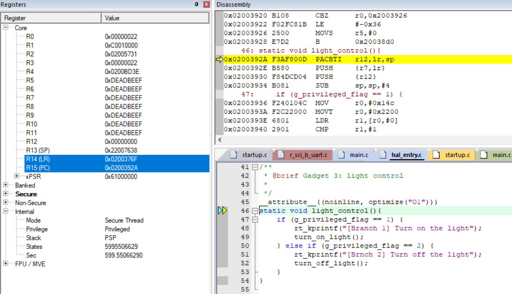

# A better use case for pure ROP

After the tests in `version_board_ROP`, we understand that it is not easy to just overwrite R12 with a correct PAC value just by guessing. Let's try a different way.

## Normal behavior : Turn on/off light

```c
__attribute__((noinline, optimize("O1")))
static void light_control(){
    if (g_privileged_flag == 1) {
		    rt_kprintf("[Branch 1] Turn on the light");
			  turn_on_light();
		} else if (g_privileged_flag == 2) {
		    rt_kprintf("[Brnch 2] Turn off the light");
			  turn_off_light();
		}
}

/**
 * @brief Demonstrate normal execution (no attack)
 */
static void demo_normal_execution(void)
{
    rt_kprintf("\n=== DEMO 1: Normal Execution ===\n");
	  light_control();
	
    const char *safe_input = "Hello";
    vulnerable_function(safe_input, 6);
    
    rt_kprintf("[RESULT] Privileged flag: 0x%08X \n\n", g_privileged_flag);
}
```

This is a simple program, where only the `flag` could decide turn on/off the light.



## Attacker's perspective

Even thought the attacker cannot change the value of flag, but it can observe the behavior of `PAC` and record the PAC value.

Two PAC examples we can get from the stacks are:

For normal execution light control stack:
```
LR 0x02003773
SP 0x22007638
R12 0xE22A66EB
```

For attack execution light control stack:
```
LR 0x020037A5
SP 0x22007638
R12 0x4495ECBD
```

By payload contruction, we can overflow the `LR` and `R12` to bypass the `AUT`, and jump back to the above addresses and change the behavior of the program.

For the above two examples, we have different attack results as:

### Example 1 


And it will jump back to normal execution stack:


Further there would be a light blink loop:

```shell
=== DEMO 2: Reuse PAC Attack ===
[Branch 1] Turn on the light
[ACK] Light should be on!


[ATTACK] branches:
  [0] turn_on_light:       0x0200A46D
  [1] turn_off_light:  0x0200A41D

[VULN] Executing memcpy (36 bytes)...
[VULN] Buffer at: 0x22007614
[VULN] Overflow complete, returning...


[VULN] Executing memcpy (6 bytes)...
[VULN] Buffer at: 0x22007614
[VULN] Overflow complete, returning...

[RESULT] Privileged flag: 0x00000002


=== DEMO 2: Reuse PAC Attack ===
[Brnch 2] Turn off the light
[ACK] Light should be off!


[ATTACK] branches:
  [0] turn_on_light:       0x0200A46D
  [1] turn_off_light:  0x0200A41D

[VULN] Executing memcpy (36 bytes)...
[VULN] Buffer at: 0x22007614
[VULN] Overflow complete, returning...


[VULN] Executing memcpy (6 bytes)...
[VULN] Buffer at: 0x22007614
[VULN] Overflow complete, returning...

[RESULT] Privileged flag: 0x00000001
```

### Example 2

if we set it as itself light control stack:

```
LR 0x020037A5
SP 0x22007638
R12 0x4495ECBD
```


This will jump back to itself but early calling stack:


and enter an infinite loop and unchangable light.


